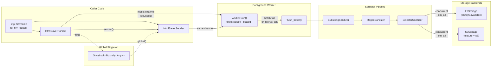

# AGENTS.md -- html_saver

## 1. Project Overview

`html_saver` is a Rust library for asynchronously saving HTML content to pluggable storage backends (filesystem, S3) with an optional sanitization pipeline. It is designed for applications that capture HTML snapshots (e.g., web scrapers, test recorders) and need to persist them without blocking the main task.

Core design principles:

- **Non-blocking**: Callers send save requests through an mpsc channel; a background tokio task batches and flushes them.
- **Zero-cost generics**: The library is generic over `R: Saveable` -- no trait objects or heap allocation per save request on the hot path.
- **Pluggable storage**: Any type implementing the `Storage` trait can serve as a backend.
- **Sanitization pipeline**: Composable chain of `Sanitizer` impls that strip sensitive data before persistence.
- **Edition 2024**: Uses RPITIT (return position impl trait in traits) instead of `async_trait`. Does not use `lazy_static` or `once_cell` -- uses `std::sync::OnceLock`.

## 2. Architecture Diagram



## 3. Module Responsibilities

### `src/lib.rs`

- **Purpose**: Crate root. Re-exports public API. Provides optional global singleton via `OnceLock`.
- **Key types**: `init()`, `global()` functions; `GLOBAL: OnceLock<Box<dyn Any + Send + Sync>>`.
- **Dependencies**: All other modules.
- **Extension points**: None -- this is glue code.
- **Safety note**: `init()` panics if called twice. The `OnceLock` stores a type-erased `HtmlSaverSender<R>` via `Box<dyn Any>` and recovers the concrete type in `global::<R>()` via `downcast_ref`. If `R` does not match the type used in `init`, `global()` returns `None`.

### `src/saveable.rs`

- **Purpose**: Defines the `Saveable` trait that user request structs implement.
- **Key types**: `trait Saveable: Send + 'static` with methods `content() -> &str` and `name() -> String`.
- **Dependencies**: None.
- **Extension points**: Users implement this trait on their own structs. The struct carries HTML content and all metadata needed for file naming. `name()` is called at flush time by the worker, not at send time.

### `src/config.rs`

- **Purpose**: Builder pattern for constructing and starting an HtmlSaver instance.
- **Key types**: `HtmlSaverBuilder<S: Storage>`.
- **Dependencies**: `handle`, `sanitizer`, `saveable`, `storage`, `worker`.
- **Configurable parameters**:
  - `batch_size` (default 50) -- max items before flush.
  - `flush_interval` (default 5s) -- periodic flush timer.
  - `channel_buffer` (default 1000) -- bounded mpsc capacity.
  - `sanitizers` -- `SanitizerPipeline`, added via `add_sanitizer()`.
  - `prefix` -- prepended to all storage keys with `/` separator.
- **Extension points**: Call `add_sanitizer(impl Sanitizer)` to add custom sanitizers.

### `src/handle.rs`

- **Purpose**: User-facing API for sending save requests and managing the worker lifecycle.
- **Key types**:
  - `HtmlSaverHandle<R>` -- owns the mpsc sender, oneshot shutdown channel, and `JoinHandle` for the worker task. Not cloneable. Must be kept alive for the worker to run.
  - `HtmlSaverSender<R>` -- lightweight, cloneable wrapper around `mpsc::Sender<R>`. Does not own shutdown or worker handle. Safe to share across tasks.
- **Dependencies**: `error`, `saveable`.
- **Design note**: `save()` uses `try_send` (non-async, non-blocking). If the channel is full, it returns `HtmlSaverError::ChannelClosed`. There is no async `save` variant.

### `src/worker.rs` (private module)

- **Purpose**: Background task that receives save requests, batches them, sanitizes content, and writes to storage.
- **Key types**: `run()` async function (the worker loop), `flush_batch()` helper.
- **Dependencies**: `sanitizer`, `saveable`, `storage`.
- **Batching strategy**: Uses `tokio::select!` with `biased` ordering: shutdown > recv > interval tick. Flushes when batch reaches `batch_size` OR when `flush_interval` fires. On shutdown, drains the channel completely before final flush.
- **Concurrency**: Within a batch, all `Storage::put` calls run concurrently via `futures::future::join_all`. Errors are logged (not propagated) -- individual item failures do not abort the batch.
- **Sanitization**: If the pipeline is empty (`is_empty()`), content is passed through without allocation. Otherwise, `sanitizers.sanitize()` is called per item.

### `src/error.rs`

- **Purpose**: Error types for the crate.
- **Key types**: `enum HtmlSaverError` with variants `StorageUpload`, `ChannelClosed`, `Sanitizer`, `Config`. Type alias `Result<T> = std::result::Result<T, HtmlSaverError>`.
- **Dependencies**: `thiserror`.

### `src/storage/mod.rs`

- **Purpose**: Defines the `Storage` trait and re-exports backends.
- **Key types**: `trait Storage: Send + Sync + 'static` with method `fn put(&self, key, content, content_type) -> impl Future<Output = Result<()>> + Send`. Uses RPITIT -- no `async_trait`.
- **Dependencies**: `error`.
- **Extension points**: Implement `Storage` for any new backend. The trait is object-safe-ish via RPITIT but the crate uses it generically (`<S: Storage>`), not as `dyn Storage`.

### `src/storage/fs.rs`

- **Purpose**: Filesystem storage backend.
- **Key types**: `FsStorage { base_dir: PathBuf }`.
- **Dependencies**: `tokio::fs`, `error`, `storage::Storage`.
- **Behavior**: Creates parent directories automatically via `create_dir_all`. Ignores `content_type`.

### `src/storage/s3.rs` (feature-gated: `s3`)

- **Purpose**: AWS S3 storage backend.
- **Key types**: `S3Storage { client: aws_sdk_s3::Client, bucket: String }`.
- **Dependencies**: `aws-sdk-s3`, `aws-config`, `error`, `storage::Storage`.
- **Construction**: `new(client, bucket)`, `from_conf(config, bucket)`, or `from_env(bucket)` (loads from environment).
- **Behavior**: Uses `put_object` with `content_type` set.

### `src/sanitizer/mod.rs`

- **Purpose**: Defines the `Sanitizer` trait and the `SanitizerPipeline` chain.
- **Key types**:
  - `trait Sanitizer: Send + Sync` with method `fn sanitize(&self, html: &str) -> String`.
  - `SanitizerPipeline` -- holds `Vec<Box<dyn Sanitizer>>`, applies them sequentially via `fold`.
- **Dependencies**: None (sub-modules depend on `regex`, `scraper`).
- **Extension points**: Implement `Sanitizer` for custom transformations. Add to pipeline via `SanitizerPipeline::add()` or `HtmlSaverBuilder::add_sanitizer()`.

### `src/sanitizer/substring.rs`

- **Purpose**: Simple string find-and-replace sanitizer.
- **Key types**: `SubstringSanitizer { rules: Vec<(String, String)> }`.
- **Behavior**: Applies `str::replace` for each rule in order.

### `src/sanitizer/regex.rs`

- **Purpose**: Regex-based sanitizer.
- **Key types**: `RegexSanitizer { rules: Vec<(Regex, String)> }`.
- **Construction**: `new()` panics on invalid patterns; `try_new()` returns `Result`.
- **Behavior**: Applies `Regex::replace_all` for each rule in order.
- **Tests**: Covers phone numbers, credit cards, emails, multi-rule ordering, empty rules, invalid patterns.

### `src/sanitizer/selector.rs`

- **Purpose**: CSS-selector-based HTML sanitizer using the `scraper` crate.
- **Key types**:
  - `SelectorSanitizer { rules: Vec<(String, SelectorAction)> }`.
  - `enum SelectorAction { RemoveAttr(String), RemoveElement, ReplaceText(String) }`.
- **Behavior**: For each rule, parses the document with `Html::parse_fragment`, finds matching elements, and applies the action. Invalid selectors are logged and skipped. Uses tree-based serialization via `ego-tree` (not string-level replacement) to handle attribute reordering by the parser.
- **Dependencies**: `scraper`, `ego-tree`.

## 4. Key Design Decisions

### Saveable trait instead of closures for naming

The `Saveable` trait lets the user's struct carry both the HTML content and all metadata needed to generate the file name. This avoids closures, keeps the channel type simple (`mpsc::Sender<R>` not `mpsc::Sender<(String, String)>`), and allows `name()` to be called lazily at flush time rather than at send time.

### Generic over `R: Saveable` (zero-cost, no heap allocation per save)

`HtmlSaverHandle<R>`, `HtmlSaverSender<R>`, and the worker are all monomorphized for the concrete `R`. This means sending a save request is just a channel send of the user's struct -- no `Box<dyn Saveable>` allocation. The tradeoff is that each crate using this library can only have one `R` type per `HtmlSaverHandle` instance.

### RPITIT instead of `async_trait`

The `Storage` trait uses `fn put(...) -> impl Future<Output = Result<()>> + Send` (RPITIT). This is a Rust edition 2024 feature that avoids the `async_trait` proc macro and its `Box<dyn Future>` allocation. Do NOT add `async_trait` to this crate.

### `OnceLock` for global state

The optional singleton pattern uses `std::sync::OnceLock` (stabilized in Rust 1.70). The stored type is `Box<dyn Any + Send + Sync>` to allow type-erased storage of `HtmlSaverSender<R>` for any `R`. Do NOT replace with `lazy_static` or `once_cell`.

### Separate `HtmlSaverHandle` vs `HtmlSaverSender`

`HtmlSaverHandle` owns the worker lifecycle (shutdown channel + JoinHandle) and is not cloneable. `HtmlSaverSender` is a cheap clone of just the mpsc sender. This prevents accidental shutdown from cloned handles and makes ownership clear: one owner manages lifecycle, many senders share the channel.

### Feature-gating S3

The `s3` feature (default-enabled) gates `aws-sdk-s3` and `aws-config` dependencies. Users who only need filesystem storage can compile with `default-features = false` to avoid pulling in the AWS SDK (~200+ crates). The `rustls-tls` feature forwards to the AWS SDK's rustls feature.

## 5. Common Tasks Guide

### Adding a new storage backend

1. Create `src/storage/my_backend.rs`.
2. Implement `Storage` for your struct. Use RPITIT: `async fn put(&self, key: &str, content: &[u8], content_type: &str) -> Result<()>`.
3. Add `mod my_backend;` and `pub use my_backend::MyBackendStorage;` to `src/storage/mod.rs`. Feature-gate if it has heavy dependencies.
4. Re-export from `src/lib.rs` if it should be part of the public API.
5. If feature-gated, add the feature and optional dependencies to `Cargo.toml`.

### Adding a new sanitizer

1. Create `src/sanitizer/my_sanitizer.rs`.
2. Implement `trait Sanitizer` -- the single method `fn sanitize(&self, html: &str) -> String`.
3. Add `mod my_sanitizer;` and `pub use my_sanitizer::MySanitizer;` to `src/sanitizer/mod.rs`.
4. Re-export from `src/lib.rs`.
5. Add unit tests in the same file under `#[cfg(test)] mod tests`.

### Adding a new feature flag

1. Add the feature to `[features]` in `Cargo.toml`.
2. Mark optional dependencies with `optional = true`.
3. Gate modules with `#[cfg(feature = "my_feature")]` in both the module declaration and re-exports.
4. Gate re-exports in `src/lib.rs`.

### Modifying the batching strategy

The batching logic lives entirely in `src/worker.rs::run()`. The `tokio::select!` loop has three branches:

1. **Shutdown** (highest priority, `biased`) -- drains channel and does final flush.
2. **Recv** -- pushes to batch, flushes if batch is full.
3. **Interval tick** -- flushes if batch is non-empty.

To change behavior (e.g., add max batch age, adaptive sizing), modify this function. The `flush_batch` helper handles sanitization and concurrent storage writes.

## 6. Testing Strategy

### Unit tests (26 tests in `src/`)

- `src/sanitizer/regex.rs` -- phone numbers, credit cards, emails, multi-rule ordering, empty rules, invalid patterns via `try_new`.
- `src/sanitizer/substring.rs` -- sensitive tokens, API keys, multiple occurrences, sequential rule application.
- `src/sanitizer/selector.rs` -- script removal, hidden inputs, tracking pixels, attribute removal, text replacement, noscript/style elements, invalid selectors.
- `src/sanitizer/mod.rs` -- pipeline chaining, empty pipeline, realistic scraping cleanup.

### Integration tests (24 tests in `tests/integration.rs`)

- `Saveable` trait: name format, content access.
- `FsStorage`: write/read, nested paths, deeply nested paths, concurrent writes.
- End-to-end: batch flush by size/interval, sanitizer pipeline, prefix, graceful shutdown drain, sender cloning across tasks, failing storage resilience, large batch scenario.
- Edge cases: empty content, special characters, long file names, channel full, save_or_log.

### Running tests

```bash
cargo test                          # all tests (needs default features)
cargo test --no-default-features    # without S3
```

### What is NOT tested

- `S3Storage` -- requires real AWS credentials. No mock or localstack setup exists.
- Global singleton (`init`/`global`) -- not tested due to `OnceLock` being process-global (would conflict across tests).

## 7. Conventions

- **Edition**: 2024. Use stable language features only.
- **Async**: tokio runtime. Use RPITIT for async traits, never `async_trait`.
- **Errors**: `thiserror` for derive. Crate-level `Result<T>` alias.
- **Logging**: `tracing` crate (`tracing::debug!`, `tracing::error!`, `tracing::info!`, `tracing::warn!`).
- **Banned crates**: `async-trait`, `lazy_static`, `once_cell` -- use std equivalents.
- **Formatting**: Run `cargo fmt` before committing.
- **Linting**: Run `cargo clippy -- -D warnings` before committing.
- **Commit style**: Conventional commits (`feat:`, `fix:`, `refactor:`, etc.).
